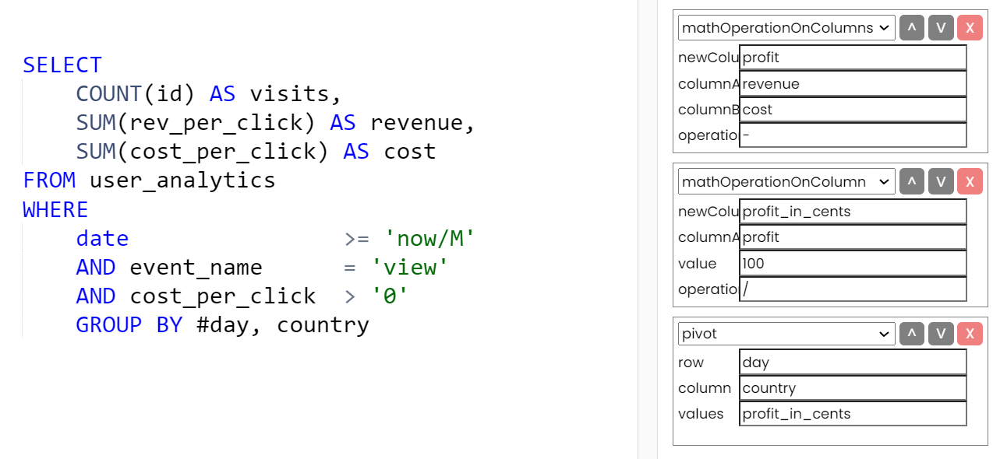
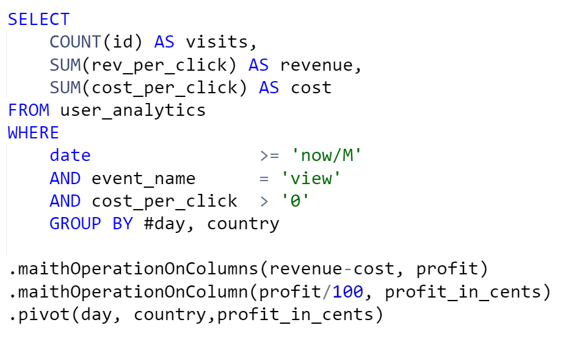
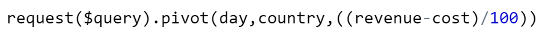
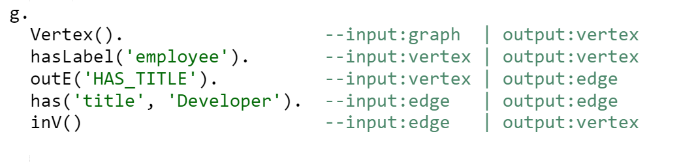

# Protolang

A naively written programming language I dropped before figuring out how hard the task actually was. Not for production, but an interesting read through for sure.


## Importance Notice:
- This was written in my junior days in 2022 (2 years before posting date)
- Coming off learning Apache Gremlin I naively assumed I could easily create a programming language
- I had a basic fever dream-ish comprehension of how to make a programming language from ripping off this PHP SQL Parser to use in another project
  - note, I re-wrote every line from scratch and added extensive comments. I understood the core parts of the parser really well
- With time the code was abandoned in favour of writing a proper programming language, however, looking back in retrospect I am deeply impressed with how many things I accidentally guessed right
- None of the code has been cleaned up, no newbie mistakes were fixed, attempting to do so will cause a stroke (you've been warned)


## What I was trying to achieve:

I noticed that 90% of my data post-processing could be achieved through chained function calls.



Due to a deeply rooted hate towards using my mouse stemming from being a backend developer, I wanted to be able to pass function calls straight into my query string


Or better yet


Gremlin showed me that a script 'traverses' the data, taking in input of one type, say a node that then returns output of a different type, say an edge.



When ripping off the PHP SQL Parser, I realized that roughly-speaking the do-while loop that iterates over tokens, simply starts at a state, and moves onto the next step when a special token is found

```php
         break;

            case 'DUPLICATE':
            case 'KEY':
            case 'UPDATE':
                if ($currCategory === 'DUPLICATE') {
                    $parsed[] = array('expr_type' => ExpressionType::RESERVED, 'base_expr' => $trim);
                    $base_expr = '';
                }
                // else ?
                break;

            case ',':
```
Knowing that, let's take a PHP script that I frequently write, and think of it in terms of the chained functions and their respective expected inputs and outputs.

```php
/** Calculate The Size of the difference of 2 arrays */

$json_a     = file_get_contents("file_a.json"); #input:string| output:json
$array_a    = json_decode($json_a, true);      #input:json | output:array

$json_b     = file_get_contents("file_b.json"); #input:string| output:json
$array_b    = json_decode($json_b, true);      #input:json | output:array

$array_difference   = array_diff($array_a, $array_b);   #input:array,array | output:array
$size_of_difference = sizeof($array_difference);        #input:array | output:int

echo($size_of_difference);                              # input:int | output:IO/none


```
I took a small chunk of the script above, and tried to imagine what it would look like within my language. <br>
So this:
```php
$json_a     = file_get_contents("file_a.json"); #input:string| output:json
$array_a    = json_decode($json_a, true);      #input:json | output:array
```
became this:
```txt
jdecode read 'a.json'
```
Ok now what? Tokenize!

### 01- Tokenizer

First thing first, I simplified the 'splitters' from the SQL Parser to include only the splitters I deemed necessary for what I wished to achieve

```php
private const SPLITTERS = ["\r\n", "!=", ">=", "<=", "<>", ":=", "\\", "&&", ">", "<", "|", "=", "^", "(",
    ")", "\t", "\n", "'", "\"", "`", ",", "@", " ", "+", "-", "*", "/", ";", "[", "]"];
```
Loosely speaking, the tokenizer is nothing more than a do-while loop that increments over the entire query string character by character

```php
    public function tokenize(
        string $dslQuery
    )
    {
        # Current Token
        $token  = "";

        # All Processed Tokens
        $tokens = [];

        # Current Character Position
        $queryCharPosition = 0;

        # Loop over every single character in the query
        while ($queryCharPosition < strlen($dslQuery))
        {
```
The comments I left during my code-rewrite explain quite well what's going on:
```php
# Since we are looping character by character, we need to know the start offset & end offset
# meaning for function print, it would see a P, then an R, then I, etc.
# Once it sees a whitespace, it knows the last time a non-special character appeared was at the offset of 'P'
# and it needs to select everything from the offset of 'P' to the current character/loop position
$selection = substr($dslQuery, $queryCharPosition, $tokenSelectorPosition);

# if the selection is an actually valid splitter
if(in_array($selection, self::SPLITTERS))
{
    # if the token is already set, append it!
    # the reason a token would already exist is the current character is a splitter meaning all the previous
    # characters were part of the same token, which we're about to set to the array
    if (isset($token))
    {
        $tokens[] = $token;
    }
    # append the current selection to the tokens
    $tokens[]                 = $selection;

    # increment the general position by the current selector-position to continue the loop
    $queryCharPosition        += $tokenSelectorPosition;

    # since this is a splitter, unset the current token since we have a clean slate now!
    unset($token);

```
The logic above leaves you with as the output:
```php
Array
(
    [0] => jdecode
    [1] => read
    [2] => '
    [3] => a.json
    [4] => '
)
```
As you can see, it's close, but now we need to figure out how to re-assemble strings back into a single token.

For this, we apply a special little magic trick which works very similar to the logic above, however, instead of iterating over a string character by character, we now iterate over our newly produced token array index by index.

```php

    private function extractNestedStrings(
        array $tokens
    ) : array
    {
        $tokenIndex = 0;        
        # loop over all the tokens
        while ($tokenIndex < count($tokens)) 
        {
            $token = $tokens[$tokenIndex];
            # if the current token is empty, we don't have anything to do
            if (!isset($token))
            {
                # increment the token counter and continue with the next loop of the while loop
                $tokenIndex++;
                continue;
            }
            # if a backtick (AKA ') is detected, we know that we need to pursue it until the pairing backtick that closes it
            if ($this->isBacktick($token))
            {
                $tokens = $this->bindTillClosureToken($tokens, $tokenIndex, $token);
            }
            $tokenIndex++;
        }
        return $tokens;
    }
```

bindTillClosureToken essentially keeps doing the same thing of looping over tokens, except now it concatenates each new token, to the first token that was present when it entered the method

```php
# since we are still here, append whatever the current token is to the initial token
$tokens[$startingTokenIndex] .= $token;

# unsetting is essential, as we moved the values of the concatenated tokens into the value of the startingToken
unset($tokens[$tokenIndex]);
```
This means that as soon the closing token is found (another backtick) we can just break out of the loop as we know all the values we need should be present in the concatenated value of the starting token that was present after the backtick that caused us to enter the method in the first place.
```php
# if the token we just appended also happens to be the closure token, break the loop and get out of the function
if ($token === $closureToken)
{
    break;
}
```
Now our output looks like what we wanted!
```php
Array
(
    [0] => jdecode
    [1] => read
    [2] => 'a.json'
)
```

### 02- Lexer

Next, I wanted to enrich each token with more information regarding:
- what it is:
  - is it a function? is it a string? or is an integer?
- what it expects the next token (or tokens) to be:
  - essentially whether it has arguments 
- and lastly, once the token has all of its arguments and is executed, what will the take its place:
  - as we agreed a function has an output type, so once a function is executed, it will replace itself with its output

```php
class readToken extends FunctionToken
{
    # What arguments does this token expect?
    public $args = [
        # expects only 1 argument
        [
            # expects the argument to be a string Token
            "cast"      => ["StringToken"],
            "value"     => NULL,
        ]
    ];
    # technically it returns a JSON but php doesn't support JSON types natively
    public $returns     = "StringToken";

    # how to actually apply this function?
    public function resolve()
    {
        return file_get_contents($this->args[0]['value']);
    }
}
```

So the lexer, simply just maps the string interpretations of the token, into an actual object representation of itself.

```php
foreach($tokens as $index=>$token)
{
    # Is this a function token?
    if(in_array($token, Utils::listTokens("FunctionToken")))
    {
        $className = "{$token}Token";
        $tokens[$index] = new $className; # instantiate the token's object
    } elseif(Utils::isEnclosedWithinArray($token))
    {
        # Array token
        $tokens[$index] = new ArrayToken($token);
    } elseif(Utils::isEnclosedWithinQuotes($token))
    {
        # String Token
        $tokens[$index] = new StringToken($token);
    } elseif(is_numeric($token))
    {
        # Int Token
        $tokens[$index] = new IntToken($token);
    } else
    {
        Throw new ParseError("Unknown Token Type For [{$token}]");
    }

```
Now the token array consists of mapped objects for each token type

```php
Array
(
    [0] => jdecodeToken Object
        (
            [args] => Array
                (
                    [0] => Array
                        (
                            [cast] => Array
                                (
                                    [0] => StringToken
                                )

                            [value] => 
                        )

                )

            [returns] => ArrayToken
        )

    [1] => readToken Object
        (
            [args] => Array
                (
                    [0] => Array
                        (
                            [cast] => Array
                                (
                                    [0] => StringToken
                                )

                            [value] => 
                        )

                )

            [returns] => StringToken
        )

    [2] => StringToken Object
        (
            [value] => a.json
        )

)
```

Now... the fun part!

### 03- Interpreter 

Let's get back to some theory.

I ripped off python here, and said that my language is eagerly trying to output something to the screen. So considering that String and Integer tokens do not expect any arguments, they get executed as soon as they are presented to the interpreter. 

Meaning in my language a query consisting solely of a string like this:

```php
"hello world"
```
is automatically rendered to the screen:
```php
OUTPUT:
hello world
```
Cool! Let's look at something more complex, like the "upper" token, which expects a string argument, that once received evaluates to an uppercased String Token. 

Providing a query that only has an "upper" token, will result in an error:

```php
Parse error: 
    [upperToken] Requires Argument [0] To Be Of Type(s) [StringToken], 
    NULL Provided
```
Meaning that the traverser moves to the upper token, but fails to move forward as it cannot 'satisfy' the next expected token type

The same logic applies to passing in a trailing token that doesn't satisfy the type of token expected next by the current token.
```php
upper 10
```
The code cannot move forward and has to fail out.
```php
```php
Parse error: 
    [upperToken] Requires Argument [0] To Be Of Type(s) [StringToken], 
    [IntToken] Provided
```
However, what is very cool, is that an exception is made for function tokens!

```php
upper lower 'HELLO WORLD' # valid code
```

Why?

When a function token is passed in where it isn't necessarily expected, we tell our execution traverser to move onto the next available token, leaving the current 'upper' token in an unsatisfied state, promising that the next function will execute and turn itself into the type of token 'upper' is expecting.


We already know that lower (to lowercase) 'HELLO WORLD' will execute and replace itself with a StringToken, which is what upper token wants!

This is the magic trick to making something like this possible:

```php
array_diff(json_decode(file_get_contents('a.json')),json_decode(file_get_contents('a.json')))
```

As if we only have 1 stream processing tokens eagerly as they come in, how the hell can we provide 2 dynamic inputs to a function that expects 2 arguments?

Essentially meaning our query of:

```php
diff jdecode read 'a.json' jdecode read 'b.json'
```
would execute like this:

```php
diff jdecode # expects 2 arrays so is unhappy, moves on
jdecode read # expects string, is unhappy, moves on
read 'a.json' # expects string, is happy, replaces itself with {1,2,3,4}
jsdeocd '{1,2,3,4}' # expects string, is string, is happy, replaces itself with [1,2,3,4]
diff [1,2,3,4] # expects 2 arguments, got 1 argument correctly, is semi-happy, keeps going
# same thing again for second argument
jdecode read # expects string, is unhappy, moves on
read 'b.json' # expects string, is happy, replaces itself with {2,4,6,8}
jsdeode '{2,4,6,8}' # expects string, is string, is happy, replaces itself with [2,4,6,8]
```
meaning now our query looks like this:

```php
diff [1,2,3,4] [2,4,6,8]
```
which satisfies the conditions of diff, executes the array_diff interpreted functions, and outputs the array to the screen (since Arrays don't expect arguments)

### 03.1 - Variables

Of course another approach would be to first perform operations, set them into variables, and then use variables as arguments to my functions. This felt less trendy, but I implemented it none the less.

```php
$var = 123;
echo $var;
```
Gremlin, a purely functional language that follows a single traversal approaches the functionality above as follows
```
.as('var') # set current data into var
...
.select('var') #place whatever is in var into current data
```

I approached the functionality similarly
```
put 'my_var' 'hello world'  # put 'hello world' into a variable called 'my_var'
get 'my_var'                # put whatever is inside my_var into the current token
```

I hacked together a solution to simply put variables in the global scope when executing a put token, which the getToken resolution function would access the value from

```php
public function resolve()
{
    global $variableMapping;
    $variableMapping[$this->args[0]['value']] = $this->args[1]['value'];
```

I did however need to add a special new token called a 'Stop' Token that the putToken would return 

```php
public $returns     = "Stop";
```
As I needed to emulate the same behaviour as at the very beginning of my traversal, essentially rendering anything after the 'Stop' token as the new State 0.

At this point, I started to get very philosophical. What exactly is the difference between a variable and a function? If a function simply returns a value, isn't that just a variable?

So clearly, next I added custom functions to my language.

### 03.2 - Custom Functions

Basic functional example:

```php
fn my_function string string {
    a  
}
my_function 'hello world'
```
Let's take a look at the lexed array of tokens that result from the query above:

```php
Array
(
    [0] => fnToken Object
        (
            [args] => Array
                (
                    [0] => Array
                        (
                            [name] => function_name
                            [cast] => Array
                                (
                                    [0] => variableToken
                                )

                            [value] => 
                        )

                    [1] => Array
                        (
                            [name] => argument(s) declaration
                            [cast] => Array
                                (
                                    [0] => argumentListToken
                                )

                            [value] => 
                        )

                    [2] => Array
                        (
                            [name] => output declaration
                            [cast] => Array
                                (
                                    [0] => argumentToken
                                )

                            [value] => 
                        )

                    [3] => Array
                        (
                            [name] => operation expression
                            [cast] => Array
                                (
                                    [0] => expressionToken
                                )

                            [value] => 
                        )

                )

        )

    [1] => variableToken Object
        (
            [value] => my_function
        )

    [2] => stringToken Object
        (
        )

    [3] => stringToken Object
        (
        )

    [4] => expressionToken Object
        (
            [value] => {
                a  
            }
        )

    [5] => variableToken Object
        (
            [value] => my_function
        )

    [6] => stringStructure Object
        (
            [value] => hello world
        )

)
```
So let's comment out what our query components map out to:
```php
# fnToken
fn 
    # function_name (variableToken)
    my_function 
        # argument (or argument) expected tokenType        
        string 
            # output expected tokenType
            string 
                # expressionToken (aka treat anything inside as a new State 0)
                {  a  }
                
# variableToken (treated the same as a regular variable)
my_function 
    # the argument token (or tokens)
    'hello world'
```

On the backend, I treated functions similarly to how I treated variables. Simply put, when a function assignation token resolved, it simply stored the expressionToken into a variable of sorts within a global array.

```php
public function resolve()
{
    global $functionMapping;
    $functionMapping[$this->args[0]['value']] = $this->args;
```

To evaluate an expressionToken when a function type variableToken was passed in, I simply built out a sub-query string within the execution flow and then ran the whole parser,lexer,interpreter arrangement again

```php
if($arg == "stringStructure")
{
    $fnExpression = preg_replace("/\s$argKey\s/", " '".$nextToken->value ."' ", $fnExpression);
}
else
{
    Throw new ParseError("Unknown SubToken Type");
}
}
$subTokens  = (new Tokenizer())->run($fnExpression);
$subTokens  = (new Lexer())->run($subTokens);
$output     = (new Interpreter())->run($subTokens);
```
I will look into this later, but while writing this out, I'm realizing this might support custom functions within functions recursively?

Since my functions did not have named variables, I chose to use an alphabetic range to express variables within the function expression in the order they were passed in into the parameters of the functions.

```php
fn my_function string,string string {
    concat upper a concat ' ' lower b 
}
my_function 'is_lower' 'is_UPPER'
```

Above for example is a function that supports two arguments (both strings) and outputs a string.

Also note that native language functions can easily be used within custom functions! 

### Putting things together

Finally, here is how to use the language!

```php
$query = "upper 'hello world'";
$tokens = (new Tokenizer())->run($QUERY);
$tokens = (new Lexer())->run($tokens);
$output = (new Interpreter())->run($tokens);
#output:
HELLO WORLD
```

## Parting Thoughts

At this point, the code got way too messy, and I was quite happy with what I achieved. So I abandoned the code. 

I've moved onto learning how to properly write a programming language after this point which will be part of MetricFrame once I release that to the general unwashed masses. 

Had I known what I was getting myself into, I would have never tried to tackle something so bold. I naively started writing a language and figuring things out as I want. Truth be told, I am absolutely shocked how much I was able to achieve, and how close this ended up being to what an actual programming language might be written like. 

As mentioned, I have not fixed up the code or reconciled the two versions, as I'm sure that trying to do so would imminently cause a stroke.